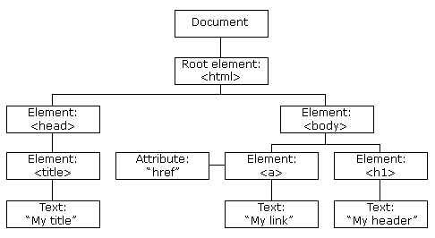

- [HTML DOM](#html-dom)
- [HTML DOM 节点](#html-dom-节点)
  - [节点](#节点)
  - [节点树](#节点树)
  - [节点关系](#节点关系)
- [HTML DOM 方法和属性](#html-dom-方法和属性)
  - [编程接口](#编程接口)
  - [DOM 对象方法](#dom-对象方法)
  - [DOM 对象属性](#dom-对象属性)
    - [nodeName 属性](#nodename-属性)
    - [nodeValue 属性](#nodevalue-属性)
    - [nodeType 属性](#nodetype-属性)
- [HTML DOM 事件](#html-dom-事件)
 
# HTML DOM
DOM(Document Object Model) 即为`文档对象模型`，是 HTML 和 XML 文档的编程接口。DOM 定义了访问和操作 HTML 和 XML 文档的标准方法。

HTML DOM 定义了所有 HTML 元素的对象和属性，以及访问它们的方法。

换言之，HTML DOM 是关于如何获取、修改、添加或删除 HTML 元素的标准。

# HTML DOM 节点
## 节点
HTML 文档中的所有内容都是节点：
- 整个文档是一个 `文档节点`
- 每个 HTML 元素是 `元素节点`
- HTML 元素内的文本是 `文本节点`
- 每个 HTML 属性是 `属性节点`
- 注释是 `注释节点`

## 节点树
DOM 以树结构表达 HTML 文档。这种结构被称为节点树。

## 节点关系
节点树中的节点彼此拥有层级关系。

常用父（parent）、子（child）和同胞（sibling）等术语来描述这些关系。父节点拥有子节点。同级的子节点被称为同胞（兄弟或姐妹）。

- 在节点树中，顶端节点被称为根（root）。
- 每个节点都有父节点、除了根（它没有父节点）。
- 一个节点可拥有任意数量的子节点。
- 同胞是拥有相同父节点的节点。

# HTML DOM 方法和属性
- HTML DOM 方法是我们可以在节点（HTML 元素）上执行的动作。
- HTML DOM 属性是我们可以在节点（HTML 元素）设置和修改的值。

## 编程接口
- 可通过 JavaScript （以及其他编程语言）对 HTML DOM 进行访问。
- 所有 HTML 元素被定义为对象，而编程接口则是对象方法和对象属性。
- 方法是您能够执行的动作（比如添加或修改元素）。
- 属性是您能够获取或设置的值（比如节点的名称或内容）。

## DOM 对象方法

| 方法                     | 描述                                                            |
| ------------------------ | --------------------------------------------------------------- |
| getElementById()         | 返回带有指定 ID 的元素。                                        |
| getElementsByTagName()   | 返回包含带有指定标签名称的所有元素的节点列表（集合/节点数组）。 |
| getElementsByClassName() | 返回包含带有指定类名的所有元素的节点列表。                      |
| appendChild()            | 把新的子节点添加到指定节点。                                    |
| removeChild()            | 删除子节点。                                                    |
| replaceChild()           | 替换子节点。                                                    |
| insertBefore()           | 在指定的子节点前面插入新的子节点。                              |
| createAttribute()        | 创建属性节点。                                                  |
| createElement()          | 创建元素节点。                                                  |
| createTextNode()         | 创建文本节点。                                                  |
| getAttribute()           | 返回指定的属性值。                                              |
| setAttribute()           | 把指定属性设置或修改为指定的值。                                |

## DOM 对象属性

| 属性                     | 描述                         |
| ------------------------ | ---------------------------- |
| innerHTML                | 节点（元素）的文本值         |
| parentNode               | 节点（元素）的父节点         |
| childNodes               | 节点（元素）的子节点         |
| firstChild               | 节点（元素）的首个子元素     |
| lastChild                | 节点（元素）的最后一个子元素 |
| attributes               | 节点（元素）的属性节点       |
| document.documentElement | 全部文档                     |
| document.body            | 文档的主体                   |
| length                   | 节点列表长度                 |

### nodeName 属性
nodeName 属性规定节点的名称。

- nodeName 是只读的
- 元素节点的 nodeName 与标签名相同
- 属性节点的 nodeName 与属性名相同
- 文本节点的 nodeName 始终是 #text
- 文档节点的 nodeName 始终是 #document

nodeName 始终包含 HTML 元素的大写字母标签名。

### nodeValue 属性
nodeValue 属性规定节点的值。

- 元素节点的 nodeValue 是 `undefined` 或 `null`
- 文本节点的 nodeValue 是文本本身
- 属性节点的 nodeValue 是属性值

### nodeType 属性
nodeType 属性返回节点的类型。nodeType 是只读的。

| 元素类型 | NodeType |
| -------- | -------- |
| 元素     | 1        |
| 属性     | 2        |
| 文本     | 3        |
| 注释     | 8        |
| 文档     | 9        |

# HTML DOM 事件
HTML DOM 允许 JavaScript 对 HTML 事件作出反应。

如需在用户点击某个元素时执行代码，请把 JavaScript 代码添加到 HTML 事件属性中： `onclick=JavaScript`。

HTML 事件:
- 当用户点击鼠标时
- 当网页已加载时
- 当图片已加载时
- 当鼠标移动到元素上时
- 当输入字段被改变时
- 当 HTML 表单被提交时
- 当用户触发按键时